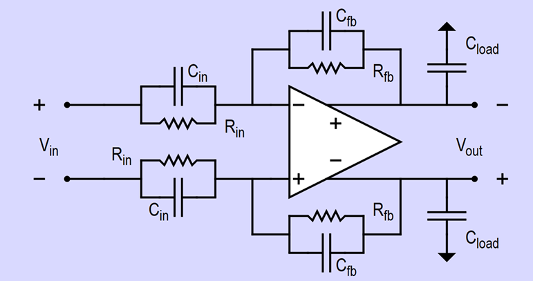

The architecture used in this project was a telescopic folded cascode amplifier with ideal gain boosting and common mode feedback blocks.
The specifications of the OPAMP design was:  
-settling time : 1.11us  
-SNR : 83.6dB  
-Accuracy : 54dB  

The overall schematic of the OPAMP is presented below. For an analytical view of the architecture and the ideal blocks that are used you can read the report or 
explore the LTspice files.

My results and some important component values are presented below. In the report/LTspice files, the exact sizes of the transistors along with other parameters
which affect the biasing circuit and hence the overall performance are presented. Lastly, my optimization process is described analytically in the report.

# Design Specifications

| Item | Design Item | Unit | Spec. | Achieved |
|------|-------------|------|-------|----------|
| 1 | Design Number | | 70 | |
| 2 | SNR | [dB] | 83.6 | 83.6 |
| 3 | A_settle | [dB] | 54 | 54 |
| 4 | T_settle | [µs] | 1.11 | 1.11 |
| 5 | BW_cl from open-loop AC simulations | [MHz] | – | 0.7029 |
| 6 | BW_cl from closed-loop AC simulations | [MHz] | – | 0.70244 |
| 7 | Time-constant τ_cl from closed-loop AC simulation | [µs] | – | 0.2266 |
| 8 | T_40dB (time to reach an accuracy of 40dB) | [µs] | – | 0.6722 |
| 9 | T_48.69dB (time to reach an accuracy of 48.69dB) | [µs] | – | 0.9299 |
| 10 | Time constant τ_cl from transient simulation | [µs] | – | 0.2577 |
| 11 | Power dissipation | [µW] | Lowest Possible | 357.336 |
| 12 | I(V_dd) | [µA] | Lowest Possible | 198.52 |
| 13 | Total integrated noise | [µV_rms] | – | 56.06 |
| 14 | Input step voltage | [mV] | 150 | 150 |
| 15 | Output step voltage | [V] | 1.2 | 1.2 |
| 16 | C_in | [pF] | – | 26.821 |
| 17 | C_fb | [pF] | – | 3.352625 |
| 18 | C_load | [pF] | – | 26.821 |
| 19 | C_CM | [pF] | – | 3.352625 |
| 20 | R_big | [GΩ] | Big | 1000 |
| 21 | C_big | [uF] | Big | 1 |
| 22 | Bonus points FoM_dB | | 0.05 | |
| 23 | FoM_lin = 2π × Power × T_8.6dB / SNR²_lin | [J] | ≤ 3.98e−18 | 2.5255 × 10⁻¹⁸ |
| 24 | FoM_dB = −10 log₁₀(FoM_lin) | [dB] | ≥ 174.0 | 175.98 |
