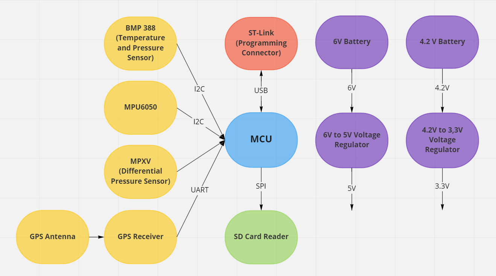

# Description
The microcontroller used for this design was the STM32G0B1KET6N. Its selection was based in the number of its pins and the availability, since at that time
there was notable shortage on STM32 microcontrollers. The PCB was mounted on the UAV aircrafts of the team in order to collect flight data, usefull for the 
aeronautics designers.

Particularly it collected raw data of pressure and temperature (BMP-388), linear and angular acceleration (MPU-6050), location tracking and altitude (NEO-M8N-0). 
A function was also build to translate the pressure data of the BMP-388 to altitude in order to have another set of altitude values. Moreover, a differential 
pressure sensor was used (MPXV7002DP) to determine the speed of the airctaft utilizing the pitot tube. Above an overview of the conceptual design is presented.

The code of the flight dara collection is not presented since I was not dynamically involved; however, a code section is presented in the report, which was a 
project assigned to me for a presentation of our PCB.
